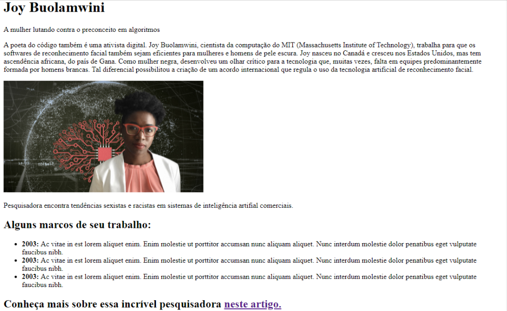

# Aula 06 - Revisão e prática II - Mesa de Trabalho

## Objetivo - Aplicar tags ao projeto inicial

Aplicar o uso correto de tags HTML, compreendendo a semântica e a estrutura do documento, de forma a criar uma página similar a esta:

## Micro desafios - Etapa 1

Vamos preparar o ambiente de desenvolvimento e versionamento de código:

1. Instale o git em sua máquina conforme informado na [página oficial](https://git-scm.com/book/pt-br/v2/Come%C3%A7ando-Instalando-o-Git 'página oficial').
2. Acesse sua conta no gitHub, crie um novo repositório e copie sua URL.
3. Na pasta onde você vai iniciar o seu projeto, clique com o botão direito e depois em Git Bash Here.
4. Execute o comando git clone <url_do_seu_repositorio> e verifique que a pasta do seu projeto foi criada.
5. Ainda no terminal git, execute o comando cd <nome_da_pasta> para acessá-la.

Tudo pronto para começarmos o desenvolvimento!

## Micro desafios - Etapa 2

Vamos criar uma página HTML para homenagear pessoas cuja dedicação e trabalho vem transformando a área de desenvolvimento de sistemas! Escolha sua inspiração para o momento e mão na massa:

1. Utilizando o VSCode, abra a pasta criada pelo git após clonar seu repositório remoto.
2. Criar um arquivo index.html e iniciá-lo com a estrutura básica de um documento HTML válido (dica: no VSCode, posicione o cursor no arquivo ainda vazio, insira um ! , pressione TAB ou ENTER e verifique o código gerado automaticamente).
3. Crie as tags para conter cada conteúdo de texto, certificando-se de utilizar títulos, subtítulos, parágrafos, listas e links, conforme ilustrado no Objetivo da atividade!
4. Adicione uma imagem para finalizar sua homenagem! Crie uma pasta img na raiz do projeto, salve uma foto de sua preferência e verifique a rota correta a ser inserida na tag HTML correspondente.
5. Certifique-se de configurar o atributo target do link ao final da página para que seja aberto em uma nova aba no navegador.

Salve as alterações e visualize o resultado em seu navegador.

## Micro desafios - Etapa 3

Vamos finalizar versionando e publicando o nosso código:

1. De volta ao terminal git, utilize o comando git add <seu_arquivo> para preparar todas as modificações realizadas, para podermos criar a primeira confirmação (versão) do projeto.
2. Ainda no terminal git, utilize o comando git commit -m “sua mensagem aqui” para de fato criar a primeira confirmação do projeto.
3. Ainda no terminal git, utilize o comando git push origin para enviar o código confirmado em sua máquina para o repositório remoto no GitHub.
4. Acesse e atualize seu repositório do GitHub para verificar a atualização.

Se chegamos até aqui, teremos ótimas homenagens para compartilhar com os professores e com a turma e continuar inspirando as transformações necessárias. Excelente trabalho!
