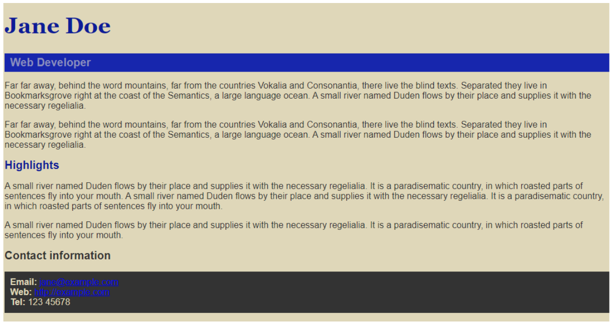

# Aula 07 - Introdução ao CSS - Mesa de Trabalho

## ObjetivoObjetivo

A partir de um documento HTML fornecido, vamos criar uma folha de estilos CSS vinculada externamente e adicionar as regras necessárias de forma a alcançar um resultado semelhante ao seguinte:

### Instruções

1.  Faça o download [desse documento index.html](https://drive.google.com/file/d/1rM_GMgS4lnnlYCRgAwA_zkG_mVEBN5-e/view 'desse documento index.html') em sua máquina.
2.  Abra a página utilizando o navegador de sua preferência para visualizar sua exibição sem nenhum estilo.
3.  Analise o código HTML, identificando as tags utilizadas, assim como seus atributos, como **class** e **id**.
4.  Crie uma pasta css e, dentro dela, crie um arquivo style.css
5.  Modifique o documento index.html adicionando a tag <link> para vincular corretamente a folha de estilos externa que você acabou de criar.
6.  Adicione as seguintes regras de estilo ao arquivo style.css:
    1. cor de fundo da tag **body** em modo RGB valores (223, 215, 185)
    2. cor do texto da tag **body** em modo RGB valores (51, 51, 51)
    3. cor do texto da tag **h1** em modo hexadecimal, valor #0d1b97
    4. cor de fundo da classe **job-title** em modo hexadecimal, valor #1726ad
    5. cor do texto da classe **job-title** em modo hexadecimal, valor #898dbe
    6. cor do texto do identificador **high** em modo RGB, valores (13, 27, 151)
    7. cor de fundo da tag **ul** em modo hexadecimal, valor 333333
    8. cor do texto da tag **ul** em modo RGB, valores (223, 215, 185)

Caso não haja erros na vinculação da folha de estilos nem na definição das regras CSS, seu site deve estar se parecendo com o Print de cima.

Se não estiver obtendo resultados semelhantes, verifique sua tag <link> para vinculação com o nome correto da folha de estilos e lembre-se de praticar a inspeção de código para procurar por regras que não estejam sendo aplicadas!

Nesse momento, já aplicamos as regras CSS que conhecemos até aqui, mas você deve estar percebendo que ainda não alcançamos o objetivo definido para a atividade. Vamos experimentar algumas novas propriedades para praticar um pouco mais as regras de estilo. A cada nova regra adicionada, verifique a visualização no navegador para observar seu efeito.

7. configure as fontes adicionando a regra font-family: Arial, Helvetica, sans-serif; à tag **body** e a regra font-family: Georgia, 'Times New Roman', Times, serif; à tag **h1**.
8. configure a propriedade **font-size** aplicando os valores 40px à tag **h1**, 20px à tag **h2** e 20px à classe **job-title**.
9. adicione a regra font-weight: bold; à classe **job-title** , certificando-se de observar o seu efeito.
10. adicione a regra padding: 5px 10px 5px 10px; à classe **job-title** e a regra padding: 10px; à tag **ul** , certificando-se de observar o seu efeito.

Agora, devemos enfim ter alcançado o objetivo inicial! Verifique o resultado em seu navegador!

## Conclusão

Parabéns! Você acaba de finalizar sua primeira folha de estilos! Além das propriedades básicas relacionadas à cor, tivemos também a oportunidade de conhecer regras relacionadas ao estilo das fontes, além da [propriedade padding](https://developer.mozilla.org/pt-BR/docs/Web/CSS/padding 'propriedade padding'). Iremos nos aprofundar nessas propriedades nas próximas aulas.
