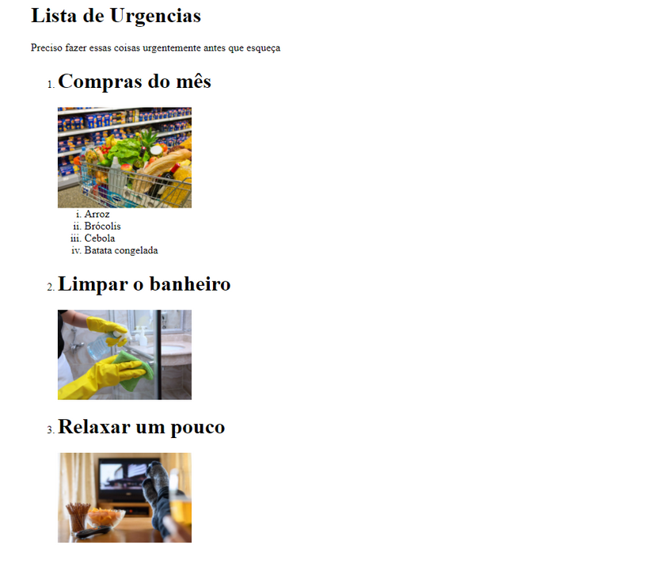

# Aula 05 - Tags - Mesa de Trabalho

## Objetivo

Criar uma lista de coisas que você precisa fazer urgentemente! Ela precisa ter um título, uma descrição, uma lista com itens contendo uma imagem (com descrição para melhorar acessibilidade) do item e o nome do item. Queremos atingir um resultado similar a esse:

## Instruções

1.  Crie um novo arquivo html.
2.  Abra o arquivo que acabou de criar dentro do Visual Studio Code.
3.  Após o arquivo html estar criado, realize os seguintes passos:
    1. Crie uma tag h1 para o título da nossa página;
    2. Defina uma breve descrição para a página utilizando a tag p;
    3. Crie uma lista ordenada com a tag ol, você pode alterar o tipo de ordenação se quiser;
    4. Adicione um item à sua lista com a tag li;
    5. Dentro da tag li que acabou de criar, crie um título para esse item com a tag h2;
    6. Ainda nesse mesmo ítem adicione uma imagem através da tag img ;
    7. Adicione um source para essa imagem através do atributo src onde você pode colar um link que copiou da imagem na internet;
    8. Descreva o que está acontecendo nessa imagem através do atributo alt;
    9. Caso o seu item seja muito abrangente como o do exemplo ‘compras do mês’, você pode utilizar outra lista dentro desse item para especificar o que você precisa comprar;
    10. Repita o mesmo processo para a criação dos itens até concluir a sua lista.

## Conclusão

Parabéns! Você acaba de concluir sua lista! Utilizamos títulos, parágrafos, listas, itens e imagens para construirmos algo que pode nos ajudar na organização. Suas páginas html podem ter diversas utilidades, como essa que acabamos de ver!
