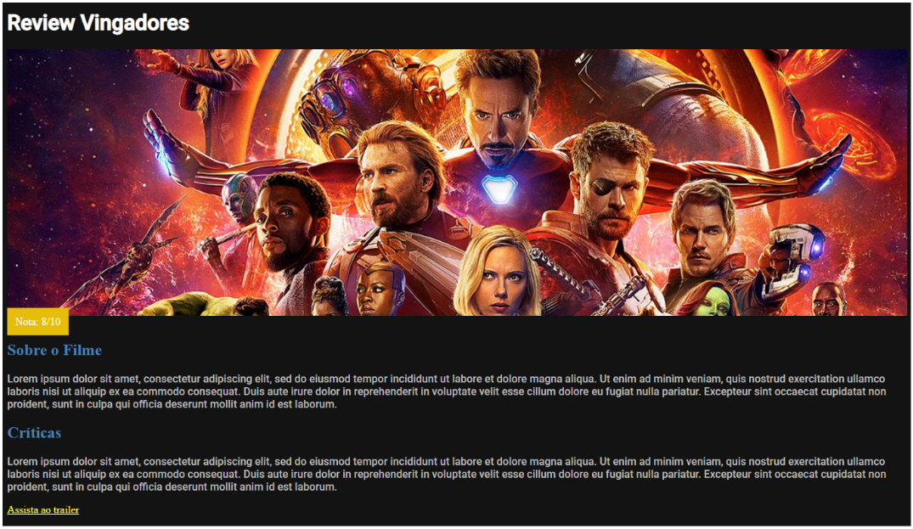

# Aula 08 - Propriedades do CSS - Mesa de Trabalho

## Objetivo

Hoje, iremos construir uma página para um portal de reviews de filmes e séries, mas o tema abordado é de sua escolha, apenas lembre-se de trocar o título e dar uma nota. Queremos atingir um resultado similar a esse:

### Instruções

1. Faça o download [desse documento index.html](https://drive.google.com/file/d/1XecESd6z6tq2FoA-KOJ7NVjHfOqGEJ_R/view?usp=sharing 'desse documento index.html') em sua máquina.
2. Abra a página utilizando o navegador de sua preferência para visualizar sua exibição sem nenhum estilo.
3. Analise o código HTML, identificando as tags utilizadas, assim como seus atributos, como **class** e **id**.
4. Crie uma pasta css e, dentro dela, crie um arquivo style.css
5. Modifique o documento index.html adicionando a tag <link> para vincular corretamente a folha de estilos externa que você acabou de criar.
6. Em seu arquivo style.css adicione a importação da sua fonte personalizada. Para isso, é só colar `@import url('https://fonts.googleapis.com/css2?family=Roboto:wght@500&display=swap');` Isso irá importar a nossa fonte Roboto diretamente do [Google Fonts](https://fonts.google.com 'Google Fonts') sem precisarmos fazer qualquer download. O @import irá importar um arquivo que for especificado dentro de url(‘ ’), no nosso caso, a fonte.
   No seu seletor do código CSS utilize a regra abaixo:
   font-family: 'Roboto', sans-serif;
7. Após a importação das fontes, adicione as seguintes regras de estilo ao arquivo style.css:

    1. cor de fundo da tag **body** em modo hexadecimal no valor #131313
    2. cor do texto da tag **h1** em cor predefinida de nome ‘white’
    3. fonte do texto da tag **h1** para Roboto
    4. altura da classe **media-picture** em 400px
    5. imagem de fundo da classe **media-picture** à sua escolha
    6. cor do texto da classe **review-score** em cor predefinida de nome ‘white’
    7. cor do fundo da classe **review-score** em modo hexadecimal no valor #e6bd09
    8. padding na classe **review-score** com valor de 12px
    9. cor de texto da tag **h2** em cor predefinida de nome ‘steelblue’
    10. cor do texto da tag **p** em modo hexadecimal no valor #bdbdbd
    11. fonte do texto da tag **p** para Roboto
    12. cor de texto da tag **a** em cor predefinida de nome ‘yellow’

Caso não haja erros na vinculação da folha de estilos nem na definição das regras CSS, seu site deve estar se parecendo com print acima.

Se não estiver obtendo resultados semelhantes, verifique sua tag <link> para vinculação com o nome correto da folha de estilos e lembre-se de praticar a inspeção de código para procurar por regras que não estejam sendo aplicadas!
Nesse momento, já alcançamos o objetivo definido para a atividade, mas caso a sua imagem tenha ficado um pouco estranha, podemos ajustá-la de acordo com sua necessidade!
Adicione a regra background-size: cover; em sua classe **media-picture**. Isso fará com que, independentemente do tamanho da sua imagem, ela se adeque à largura de 100% que definimos.
Agora podemos posicioná-la na direção em que você achar melhor, lembrando que esse passo é opcional. Adicione a regra background-position: center; em sua classe **media-picture**. Isso fará com que a imagem se ajuste ao centro, mas podemos alinhar em outros eixos também.
Você pode trocar o valor center por left, top, right e bottom. Cada um deles irá ajustar a imagem de uma maneira diferente, faça o teste e descubra qual posição fica melhor para sua imagem!

## Conclusão

Parabéns! Você acaba de concluir sua página de review! Utilizamos fontes personalizadas, diferentes maneiras de referenciar cores, imagens e cores como background, além de posicionamento de background para construir nossa linda página. Estamos começando a nos aprofundar cada vez mais nas propriedades do css, e se já está gostando dos resultados agora, irá adorar os próximos!

[Documento original](https://docs.google.com/document/d/1gV9drbRa93ci-y1d9LsDLL6sF7-eW54BkK9bib-LHiM/edit# 'Documento original')
